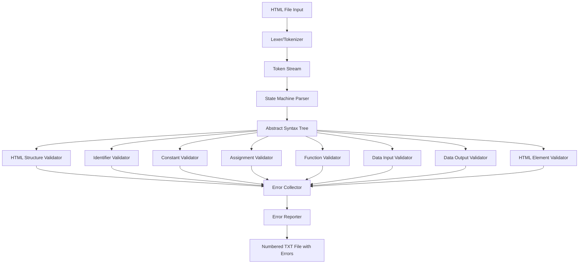

# HTML/JavaScript Validator with AST

Approach

## Architecture Overview

The system uses a pipeline: **Lexer → Parser (State Machine) → AST → Validators → Error Reporter**




## Core Components

### 1. Lexer (`Lexer.java`)

- Tokenize HTML and JavaScript into tokens
- Token types: HTML_TAG_OPEN, HTML_TAG_CLOSE, HTML_ATTRIBUTE, JS_KEYWORD, JS_IDENTIFIER, JS_OPERATOR, JS_LITERAL, JS_PUNCTUATION, WHITESPACE, COMMENT
- Track line numbers for error reporting
- Handle embedded JavaScript within `<script>` tags

### 2. Parser (`Parser.java` - State Machine)

- Finite state automaton with states: HTML_MODE, SCRIPT_MODE, STRING_MODE, COMMENT_MODE
- Build comprehensive AST with nodes for:
- HTML: DocumentNode, TagNode, AttributeNode, TextNode
- JavaScript: ScriptNode, FunctionNode, VariableNode, AssignmentNode, ExpressionNode, CallNode
- Maintain context (current scope, declared variables, HTML elements)

### 3. AST Node Classes (`ast/` package)

```javascript
ast/
├── Node.java (base interface)
├── html/
│   ├── DocumentNode.java
│   ├── TagNode.java
│   ├── AttributeNode.java
│   └── TextNode.java
└── js/
    ├── ScriptNode.java
    ├── FunctionNode.java
    ├── VariableNode.java
    ├── ConstantNode.java
    ├── AssignmentNode.java
    ├── ExpressionNode.java
    ├── CallNode.java
    └── IdentifierNode.java
```


### 4. Validators (`validators/` package)

- `HtmlStructureValidator.java` - Requirement #8 (25 pts)
- `IdentifierValidator.java` - Requirement #2 (10 pts)
- `ConstantValidator.java` - Requirement #3 (10 pts)
- `AssignmentValidator.java` - Requirement #4 (15 pts)
- `FunctionValidator.java` - Requirement #5 (15 pts)
- `DataInputValidator.java` - Requirement #6 (10 pts)
- `DataOutputValidator.java` - Requirement #7 (10 pts)
- `HtmlElementValidator.java` - Cross-validator for #6 and #7

### 5. Error Management (`errors/` package)

- `Error.java` - Error data structure (line, number, description, type)
- `ErrorCollector.java` - Centralized error collection
- `ErrorReporter.java` - Generate numbered TXT file with errors

### 6. Main Orchestrator (`Main.java`, `ValidatorEngine.java`)

- `Main.java` - Entry point, file I/O
- `ValidatorEngine.java` - Coordinate lexer, parser, validators, reporter

## File Structure

```javascript
src/
├── Main.java
├── ValidatorEngine.java
├── lexer/
│   ├── Lexer.java
│   ├── Token.java
│   └── TokenType.java
├── parser/
│   ├── Parser.java
│   └── ParserState.java
├── ast/
│   ├── Node.java
│   ├── html/
│   │   ├── DocumentNode.java
│   │   ├── TagNode.java
│   │   ├── AttributeNode.java
│   │   └── TextNode.java
│   └── js/
│       ├── ScriptNode.java
│       ├── FunctionNode.java
│       ├── VariableNode.java
│       ├── ConstantNode.java
│       ├── AssignmentNode.java
│       ├── ExpressionNode.java
│       ├── CallNode.java
│       └── IdentifierNode.java
├── validators/
│   ├── Validator.java (interface)
│   ├── HtmlStructureValidator.java
│   ├── IdentifierValidator.java
│   ├── ConstantValidator.java
│   ├── AssignmentValidator.java
│   ├── FunctionValidator.java
│   ├── DataInputValidator.java
│   ├── DataOutputValidator.java
│   └── HtmlElementValidator.java
├── errors/
│   ├── Error.java
│   ├── ErrorCollector.java
│   └── ErrorReporter.java
└── utils/
    ├── FileUtils.java
    └── ReservedWords.java
```


## Implementation Steps

### Phase 1: Foundation (Lexer & Basic AST)

1. Create `Token.java` and `TokenType.java` - Define token structure
2. Implement `Lexer.java` - Tokenize HTML and JavaScript
3. Create base `Node.java` interface and basic AST node classes
4. Test lexer with simple HTML file

### Phase 2: Parser (State Machine)

1. Define `ParserState.java` enum (HTML_MODE, SCRIPT_MODE, STRING_MODE, etc.)
2. Implement `Parser.java` with state machine logic
3. Build AST nodes during parsing
4. Handle transitions between HTML and JavaScript modes
5. Test parser with example files from PDF

### Phase 3: Validators (Requirements 1-8)

1. Create `Error.java` and `ErrorCollector.java`
2. Implement `ErrorReporter.java` for Requirement #1 (numbered output)
3. Implement `IdentifierValidator.java` (Requirement #2)
4. Implement `ConstantValidator.java` (Requirement #3)
5. Implement `AssignmentValidator.java` (Requirement #4)
6. Implement `FunctionValidator.java` (Requirement #5)
7. Implement `DataInputValidator.java` (Requirement #6)
8. Implement `DataOutputValidator.java` (Requirement #7)
9. Implement `HtmlStructureValidator.java` (Requirement #8)
10. Implement `HtmlElementValidator.java` - Track HTML elements for #6/#7

### Phase 4: Integration & Main

1. Implement `ValidatorEngine.java` - Orchestrate all components
2. Update `Main.java` - File I/O, command-line interface
3. Create `FileUtils.java` - File reading/writing utilities
4. Create `ReservedWords.java` - JavaScript reserved words list

### Phase 5: Testing & Documentation

1. Test with provided example files
2. Test edge cases (whitespace, empty lines, nested structures)
3. Add JavaDoc comments to all classes
4. Create implementation documentation

## Key Design Decisions

1. **State Machine Parser**: Handles HTML/JS mode switching cleanly
2. **Comprehensive AST**: Full representation enables all validators to work independently
3. **Visitor Pattern**: Validators traverse AST nodes (optional, can use direct traversal)
4. **Error Collector**: Centralized error management before reporting
5. **Line Number Tracking**: Every AST node stores its line number for error reporting

## Bug Fixes Applied (Post-Implementation)

### Issue 1: Missing HTML Tag Detection

**Problem**: Parser was not correctly identifying `<html>` tag when it appeared on the same line as other tags like `<html><head>`.**Solution**:

- Enhanced `parseSingleHTMLTag()` to always check and set htmlTag if tagName is "html", regardless of tagStack state
- Added fallback in `HtmlStructureValidator` to search document children if `getHtmlTag()` returns null
- Lexer correctly tokenizes each tag separately (stops at first `>`) while respecting quoted attribute values

### Issue 2: Constant Assignment Parsing

**Problem**: Parser was not correctly recognizing complex expressions like `new Date()` and method chaining like `document.getElementById("id").value` as valid constant assignments.**Solution**:

- Added support for `new` keyword parsing in `parseExpression()` method
- Enhanced `parseMethodCall()` to handle property access chains (e.g., `.value` after method calls)
- Improved expression parsing to correctly handle nested method calls and property access

### Issue 3: Invalid Assignment Operator Errors

**Problem**: AssignmentValidator was incorrectly flagging comparison operators (`<`, `>`, `<=`, `>=`, `==`, `!=`, `===`, `!==`) and logical operators (`&&`, `||`) as invalid assignment operators. Also flagging property access operators (`.`) as invalid.**Solution**:

- Added `isAssignmentOperator()` helper method in Parser to verify operators before creating AssignmentNode
- Modified `parseAssignment()` to only create AssignmentNode for actual assignment operators (=, +=, -=, *=, /=, %=)
- If a non-assignment operator is encountered, `parseAssignment()` now calls `parseExpression()` instead
- Comparison and logical operators are correctly handled in ExpressionNode instances and not validated by AssignmentValidator

## Bug Fixes Applied (Post-Implementation)

1. **Multiple HTML Tags on Same Line**: Fixed parser to correctly identify `<html>` tag even when followed immediately by `<head>` on the same line. Parser now splits multiple tags in a single token if needed. Lexer properly tokenizes each tag separately by stopping at the first `>` while respecting quoted attribute values.